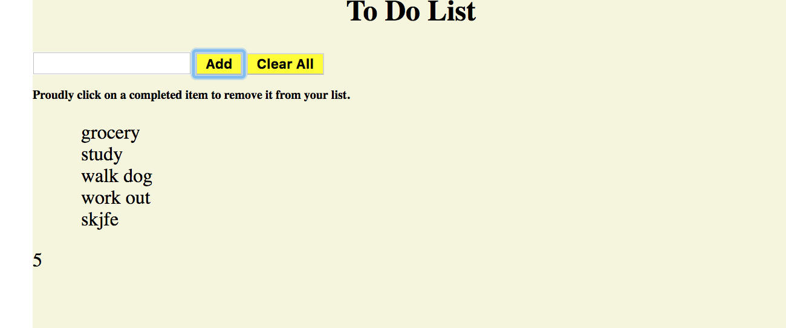

# TO DO LIST PROJECT
An application that allows users to input to do list items, delete individuals items, and clear the whole list.

## How It's Made:
Used a form, input, and buttons to get then retrieve values from the form and append the value to the list items in the dom.

**Tech used:** HTML, CSS, Jquery

## Optimizations
I would add a feature to check off/strike through list items when completed so that users can reference completed items.

## Lessons Learned:

I learned how to append and hide items in the li using jquery and css.
