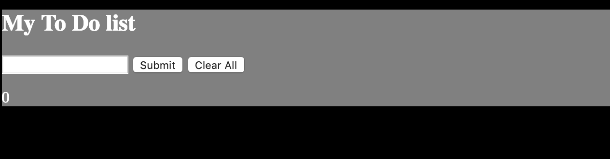

# My Awesome Project

Quickly type in what needs to be done for the day, week or month with my easy to use to do list. Once your task is complete you can cross them off and remove them individually or clear the complete list.

**Link to project:**

## How It's Made:

**Tech used:** HTML, CSS and JQuery

I built this project by creating an HTML document in order to create the header, input form, button elements and the list. Then I created the JavaScript file that will target the elements in my HTML document and give each element a function. After I completed both the HTML and JQuery I created a CSS file in order to style my site background color and font styles.

## Lessons Learned:

Here I learned how to use the append method on JQuery. 
